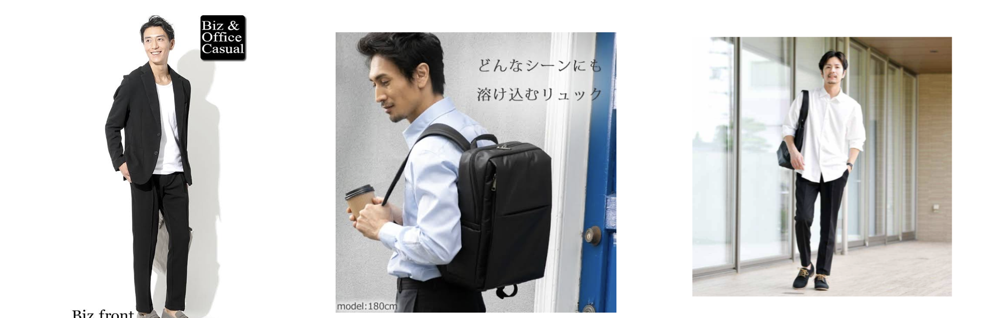

# DM用_ 体験講習構築

## 流れ

- 日程調整中
- 場所の提案
- 流れと服装の追記
- 前日リマインド
- 当日リマインド

## 文言

**日程調整中**

自分

    ちなみに平日と週末だったら
    どちらの方が都合が良いとかありますか？

相手の返答

---
自分

    来週の平日/土日であれば、
    12:00-18:00のうち2時間位いけます！

    O/O(日)...4つほど
    この日にちのなかで大丈夫な日はありますか？

    ※ 開始時間が12時、終了時間が18時という認識です！

相手の返答

---
自分

    それではO/O(日)のOO時からにしましょう！

相手の返答

---
**場所の提案**

自分

    場所は初心者でも声かけしやすい場所が渋谷にあるので、
    もし大丈夫であれば渋谷でやろうと思うのですが、
    よろしいでしょうか？

**流れと服装の追記**

自分

    合流/講習の流れについて、簡単に共有させていただきますね！

---

    流れ

    1. カウンセリング
    ・どういう理想の状態を実現したいか
    ・今の悩みは
    などを深掘って、目標を一緒に決めていきます。

    2. ナンパの指導
    「ナンパ未経験者でも、女性が立ち止まってくれる声掛けメソッド」
    をレクチャーします。

    3. ナンパ実践
    はじめにしまうまが声掛けのお手本を見せます。
    そこから講習生に声掛けを実際にしてもらい
    しまうまがあなたの後ろを付いて歩きながら、
    声かけのタイミングやフォーム、表情など、適宜アドバイスします。

    4. フィードバック
    全体的な振り返りと今後に向けてのアドバイス。

    ＋α ）しまうま本講習のご案内 ※
    ※本格的に自分を変えたい方にのみご案内いたします。

---

    服装は、上のイメージのようにカジュアルスーツっぽい形で白Tシャツに黒ズボンでOKですね。
    もしそのような服がなければ、清潔感のある服を着ていただければと思います！

**前日リマインド**

    しまうまです。

    明日は体験講習、よろしくお願いいたします！
    OO時に渋谷駅の南改札でお待ちしております！

**当日リマインド**

    後ほどはよろしくお願いいたします！
    もし着きましたらメッセージをいただければありがたいです！

    白Tシャツに黒ズボンの服装で
    僕を見つけていただければと思います！
